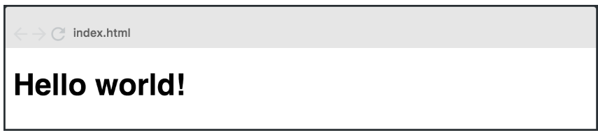
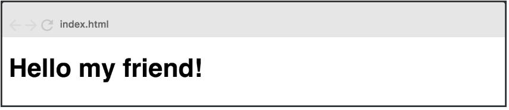

# Trabajo Práctico React 💻

Aquí describimos los ejercicios 1 y 2 del Trabajo Práctico de REACT.

## Ejercicio 1 y 2 ✅

### Ejercicio 1

1. Hello world - Dificultad: 🟢

   Crear una aplicación web con un componente que muestre en pantalla el mensaje “Hello World”.

   

---

### Ejercicio 2

2. Hello world (parte 2)- Dificultad: 🟢

   Modificar el componente anterior y enviar mediante props el valor “My friend” de manera que el mensaje quede de la siguiente forma:

   

Utilizamos [React-Bootstrap](https://react-bootstrap.netlify.app/) **v2.9.0** en nuestro proyecto para incoroporar el Container, y usamos el **"bootstrap/dist/css/bootstrap.min.css"** para utilizar los estilos de Bootstrap.

---

> **IMPORTANTE:** Para ambos casos tenemos que importar estas herramientas con el **import**.

---

Además utilizamos el objeto props para mandar información (en este caso un string que sería el stubtítulo) desde un Componente padre (**App.jsx**) a un Componente hijo (**Titulo.jsx**).

## Repositorio

Los ejercicios se encuentran en el sgte. repositorio:
https://github.com/EmiTorres93/RCS-43i-React_exercise1

- Para clonar el repositorio:

```bash
git clone https://github.com/EmiTorres93/RCS-43i-React_exercise1
```

- Para contribuir con el proyecto ponerse en contacto con el sgte. mail: **practica@gmail.com**

## Autores

1. Emiliana M. Torres [GitHub](https://github.com/EmiTorres93)
